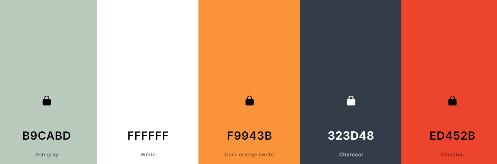

<h1 align="center">Time Master Website </h1>
[View the live project here.](https://monika-mak.github.io/time_master_PP1/)


Welcome to the Time Master website. This platform is designed for individuals who often find themselves saying, "there are never enough hours in the day." It aims to tackle common productivity issues by addressing the excuses we tell ourselves, providing a support system through powerful tips and insights for better time management. 

## User Experience (UX)

-   ### User stories
    -    ### First Time Visor Goals

            1.Understand the main purpose of the site and learn about productivity.
            2.Identify personal productivity challenges and discover resources to improve time management.
            3.Navigate the site easily to find relevant information.

    -   ### Returning Visitor Goals
            1.Recap impactful productivity strategies.
            2.Access interactive tools to enhance daily productivity.

    -   ### Frequent User Goals
            1.Stay updated with new productivity techniques or tools.
            2.Regularly review effective productivity strategies.

-   ### Design
    -   #### Colour Scheme
            The website uses a palette of green, white,and orange along with some charcolar and red. All colors were carefuly designed and matched for good contrast. 
            
       
    -   #### Typography
        -   Open Sans is the primary font, chosen for its readability and modern appearance. 
            It's paired with Sans Serif as the fallback to ensure text is legible and clean across all devices and browsers.
            The second font is  Montserrat, for its  clarity and modern feel
    -   #### Imagery
        -   The website employs motivational and imagery to encourage users to explore and utilize productivity techniques.
            Large, striking hero image is used to capture attention and highlight the main messages.


*   ### Wireframes

    -   Home Page Wireframe - [View](https://github.com/)

    -   Mobile Wireframe - [View](https://github.com/)

    -   Contact Us Page Wireframe - [View](https://github.com/)

    ## Features
        # Time Master Website Feature Overview

    ## Introduction
        Time Master is designed to enhance personal productivity by offering tools and insights into effective time management. This website is your gateway to mastering your schedule with intuitive features and easy navigation.

    ## Website Structure and Navigation

    ### Header and Navigation Bar
    - **Responsiveness:** The navigation bar is responsive, adjusting to different device screens. On mobile devices, it transforms into a hamburger menu to save space and maintain usability.
    - **Logo and Branding:** The Time Master logo is prominently displayed on the left side of the navigation bar, reinforcing the brand on every page.
    - **Navigation Links:** Easy-to-access links for Home, Features, Tips, and Contact sections ensure users can navigate the site with minimal effort.

    ### Hero Image
    - **Visual Appeal:** A large, engaging hero image captures attention on the home page, along with the bold multicoloured text setting a motivational tone with a clock visual to emphasize time management.


    ### Main Content and List Items
    - **Content Layout:** The main content Starts with qualifying users for further exploration, since it is a productivity website, we (AKA me) don’t want to waste their time.  
    The Headline itself raises the question “Do I have a  productivity issue ?” 
    User then have a decision to make, :
    Find out more : they realizes / confirms that they are indeed lacking productivity. Where conviniently they can do it by clicking “see tips” link under “yes” section. 
    Leave the page and move on with their day. 
    They morelikey do not have productivity issue. 
    *note -  this may be a harsh approach for some , but taking to consideration time and money spend on unqualified users, this may be a necessary step. 

    - **Excuses Lists:** Features and tips are presented in list formats with icons or bullet points for easy reading and quick comprehension.

    ### Footer
    - **Navigation:** Contains quick links to important pages like Tips and Contact; 
    - **Social Media Links:** Icons linking to social media platforms to enhance community engagement and provide updates on new features or tips.

    ### Functional Highlights
    - **'Excuse Buster' Feature:** Interactive section where users input common procrastination excuses to receive tailored advice and strategies.
    - **Productivity Tips:** Categorized tips that users can apply to different aspects of their work or study routines.
    - **Contact Form:** A straightforward form that allows users to send inquiries directly through the website, improving user interaction and support.

    ## User Journey
    1. **First-Time Visitors** are greeted by the hero image and a brief introduction to the site’s purpose, with easy options to explore features or contact for more information.
    2. **Returning Visitors** can quickly navigate to their areas of interest like new productivity tips or updated features through the responsive navigation bar.
    3. **Frequent Users** benefit from personalized content like saved tips or suggested new strategies in the features section.

    ## Future Enhancements
    - **Interactive Tools:** Implementation of dynamic tools like a real-time productivity tracker or a customizable task list.
    - **Community Features:** Options for users to share their own tips or success stories, fostering a community of productivity enthusiasts.

    ### Navigation Bar: Responsive across devices, featuring a logo and easy-to-access links for Home, Tips, and Contact sections.
        ### Hero Image: A large image sets the motivational tone, focusing on productivity.
        Main Content: Challenges users to consider if they have productivity issues and provides quick navigation to tips.
        Footer: Contains links and social media icons for extended interaction.

    -   Responsive on all device sizes

    -   Interactive elements


    ## Resources and Tools Used

    ### Fonts and Icons
    - [Google Fonts](https://fonts.google.com/) - Imported fonts used throughout the website.
    - [Font Awesome](https://fontawesome.com/) - Provided the iconography on the website.

    ### Development Tools
    - [Google Dev Tools](https://developer.chrome.com/docs/devtools/) - Used for troubleshooting, testing features, and solving issues related to responsiveness and styling.
    - [GitHub](https://github.com/) - Used to save and store the project files.
    - [Adobe Firefly](https://www.adobe.com/products/firefly.html) - Utilized to generate AI-enhanced images (Hero Image).

    ### Image and Color Resources
    - [Tiny PNG](https://tinypng.com/) - Compressed images to optimize website performance.
    - [Favicon.io](https://favicon.io/) - Tool used to create the website's favicon.
    - [Coolors](https://coolors.co/) - Assisted in creating a modern, matching color palette.
    - [Canva](https://www.canva.com/) - Used for creating mockups and wireframes.
    - [Pexels](https://www.pexels.com/) - Supplied stock images for the website.

    ### Testing and Responsiveness
    - [Am I Responsive?](http://ami.responsivedesign.is/) - Showcased the website on a range of devices to check responsiveness.


    ### Languages Used

    -   [HTML5](https://en.wikipedia.org/wiki/HTML5)
    -   [CSS3](https://en.wikipedia.org/wiki/Cascading_Style_Sheets)


    ## Testing

        The W3C Markup Validator and W3C CSS Validator Services were used to validate every page of the project to ensure there were no syntax errors in the project.

        -   [W3C Markup Validator](https://jigsaw.w3.org/css-validator/#validate_by_input)  -    [Results](https://github.com/)
        -   [W3C CSS Validator](https://jigsaw.w3.org/css-validator/#validate_by_input) - [Results](https://github.com/)

        ### Testing User Stories from User Experience (UX) Section
            The website has been tested on multiple browsers (Chrome, Firefox, Safari) and on mobile, tablet, and desktop devices. 
            User testing was conducted to ensure that navigation is intuitive and the site meets the needs outlined in user stories.

        ### Further Testing

        - Friends and family tested the site for usability issues and bugs.


    ### Known Bugs
        - no known bugs recorded; 

    ## Deployment

    ### GitHub Pages

    The project was deployed to GitHub Pages using the following steps...

    1. Log in to GitHub and locate the [GitHub Repository](https://github.com/)
    2. At the top of the Repository (not top of page), locate the "Settings" Button on the menu.
        - Alternatively Click [Here](https://raw.githubusercontent.com/) for a GIF demonstrating the process starting from Step 2.
    3. Scroll down the Settings page until you locate the "GitHub Pages" Section.
    4. Under "Source", click the dropdown called "None" and select "Master Branch".
    5. The page will automatically refresh.
    6. Scroll back down through the page to locate the now published site [link](https://github.com) in the "GitHub Pages" section.

    ### Forking the GitHub Repository

    By forking the GitHub Repository we make a copy of the original repository on our GitHub account to view and/or make changes without affecting the original repository by using the following steps...

    1. Log in to GitHub and locate the [GitHub Repository](https://github.com/)
    2. At the top of the Repository (not top of page) just above the "Settings" Button on the menu, locate the "Fork" Button.
    3. You should now have a copy of the original repository in your GitHub account.

    ### Making a Local Clone

    1. Log in to GitHub and locate the [GitHub Repository](https://github.com/)
    2. Under the repository name, click "Clone or download".
    3. To clone the repository using HTTPS, under "Clone with HTTPS", copy the link.
    4. Open Git Bash
    5. Change the current working directory to the location where you want the cloned directory to be made.
    6. Type `git clone`, and then paste the URL you copied in Step 3.

    ```
    $ git clone https://github.com/YOUR-USERNAME/YOUR-REPOSITORY
    ```

    7. Press Enter. Your local clone will be created.
    ```

    Click [Here](https://help.github.com/en/github/creating-cloning-and-archiving-repositories/cloning-a-repository#cloning-a-repository-to-github-desktop) to retrieve pictures for some of the buttons and more detailed explanations of the above process.

    ## Credits


    ### Code

        Code was created by myself, used by following the Love running walkthrough; 

    ### Content 

        Content was inspired by a Video about completing a month task in a day, various resources were used listed below :
        - [How To Finish One Month of Work Today](https://www.youtube.com/watch?v=Q7Phkq0BUXM)  

        ### Learning and Support Resources
    
        - [W3Schools](https://www.w3schools.com/) - For learning and practice.
        - [YouTube](https://www.youtube.com/) - To source a deeper understanding of concepts, mainly Flexbox.
        - [Code Institute](https://codeinstitute.net/) - To structure and support learnings.
        - [CSS-Tricks](https://css-tricks.com/) - For Flexbox learning support.
        - [ChatGPT](https://openai.com/chatgpt) - For quick information support when needed.
        - [Perplexity AI](https://www.perplexity.ai/) - For a focused source of information in one place.
        - [Iris](https://www.iristech.co/) - To validate information given on the website TimeMaster.co.

        ### Productivity and Focus
        - [Study Music, Concentration, Focus](https://www.youtube.com/results?search_query=study+music+concentration+focus) - To keep me calm during work.


    ### Acknowledgements
        A massive shout-out to:

        Amy Richardson- for constant support as well as great advices throughout the process; 
        Femi-  my mentor who utilised our meetings very well, giving constructive feedback and excellent practise. 
        Valentyn_5P- for great team support;
        Huge Thanks to the community for great support and helping me feel like i am not here alone. 
